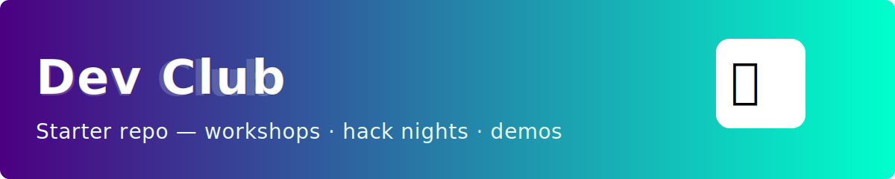

<!-- Banner image -->


<!-- Short, colorful Dev Club starter README. Using badges for color because GitHub strips inline styles. -->

[](https://github.com/devv-Anmol)
[](https://github.com/devv-Anmol/dev_club-repo-boot)

# dev_club-repo-boot


A concise starter repo for Dev Club projects — clear onboarding, simple workflow, and room to grow. 🤖

## Goals

- Fast onboarding for workshops & hack nights.
- Teach good collaboration (branches, PRs, reviews).
- Be adaptable to any stack (Node, Python, web, mobile).

## Quick start

```bash
git clone https://github.com/devv-Anmol/dev_club-repo-boot.git
cd dev_club-repo-boot
# install deps if present (npm / pip / etc.)
```

## Contributing (short)

- Branch from `main` (feat/...), commit small changes, open a PR.
- Add tests/docs for public changes. Request review from a teammate.

## Highlights — what I liked

- Clear one-minute setup.
- Friendly tone + helpful next steps.
- Suggested structure keeps things tidy for beginners.

---

Note: GitHub sanitizes many HTML styles, so instead of changing font color directly we use colored badges and images for visual emphasis. Want a specific color scheme or a custom banner image? I can add an SVG banner or local image.

Happy hacking! 🎉
